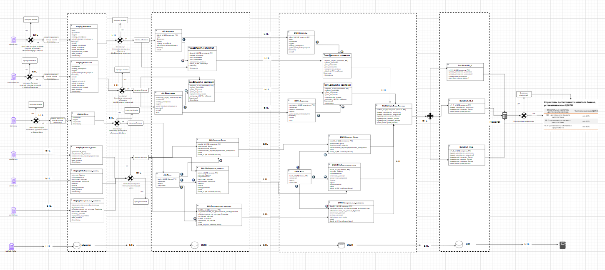
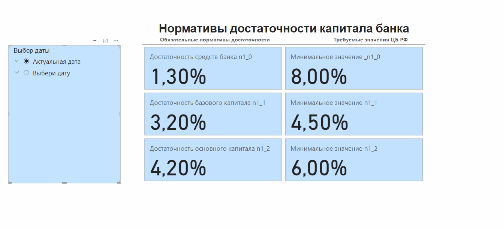

# DWH для формирования регуляторной отчетности по нормативам ЦБ

Это база данных на postgres, состоящая из слоев:
- staging
- dds
- dwh
- data_mart

Перевод данных со слоя на слой осуществляется через запуск python скриптов в командной строке, своего рода механизм ETL.
При переводе данных со слоя на слой осуществляется соответствующая обработка данных и хранение их на заявленном слое.

## Схема функционирования БД:



## Пример финального предоставления отчетности через Power BI



## Исходные данные:
Исходные данные передаются в .csv файлах
`assets.csv` - данные по активам банка
```pycon
securities,real_estate,financial_reports,credit_facilities,machinery,debts,equipment,timestamp_column
1000.50,2000.75,3000.30,4000.20,5000.40,6000.60,7000.80,2024-05-01 00:00:00.000
...
```

`liabilities.csv` - данные по пассивам банка
```pycon
financial_instruments_debts,securities_obligations,reporting_data,invoices_to_pay,funds_in_accounts,timestamp
1234.56,2345.67,3456.78,4567.89,5678.90,2024-05-01 00:00:00.000
...
```

`capital.csv` - данные по капиталу банка
```pycon
reserve_fund,equity_capital,accumulated_earnings,timestamp_column
9500.75,7000.30,1800.50,2024-05-01 00:10:00
...
```

`bank.csv` - статичная информация о банке
```pycon
id, name, address, license_number, timestamp_column
Bank of America, 123 Main Street, 556789
...
```

`clients.csv` - данные о клиентах банка и их депозитах
```pycon
first_name,last_name,address,phone_number,registration_date,email,deposit_amount,opening_date,closing_date,interest_rate
Алиса,Иванова,ул. Центральная,555-123-4567,2024-01-01,alice.ivanova@example.com,1000.00,2024-01-01,2024-12-31,0.05
...
```

`companies.csv` - данные о юридических компаниях, у которых открыты депозиты в банке и информация о них.
```pycon
name,phone_number,address,registration_date,email,inn,deposit_amount,opening_date,closing_date,interest_rate
Company A1,1234567890,Address A,2024-01-10,companya@example.com,123456789,10000.00,2024-01-15,2024-12-31,0.03
...
```

## Подготовительные операции

### 1. Копируем содержимое проекта себе в рабочую директорию
```
git clone <метод копирования>
```
У вас будут 5 рабочих файлов:
- `loading_from_file.py` - этот файл для загрузки данных из изначальных файлов
- `add_to_dds.py` - этот файл для преобразования данных со слоя staging на dds
- `add_to_dwh.py` - этот файл для преобразования данных со слоя dds на dwh
- `common_data.py` - этот файл для сбора/агригации данных на слое dwh
- `data_mart.py` - этот файл для финальной группировки данных на витрине данных data_mart

### 2. Устанавливаем библиотеки:
```
pip install -r requirements.txt
```

### 3. Для хранения переменных окружения создаем файл .env:
```
touch .env
```

В `.env` записываем пути до файлов с исходными данными, а также параметры для подключения к вашей БД (базе данных)

`DELTA_DAYS` - это количество дней в которых будут искаться данные, если нет данных на текущее число. 
Пример, если сегодня 25.12.24, но данных по активам, пассивам или капиталу нет на это число, то программа будет проверять эти данные на 
24.12.24 и т.д. на количество дней, указанных в `DELTA_DAYS`, если не найдет, то значение будет None

```pycon
DB_NAME="pomidor"
DB_HOST="localhost"
DB_USER="postgres"
DB_PASS="....."
PATH_CLIENTS="loading_files/clients.csv"
PATH_COMPANIES="loading_files/companies.csv"
PATH_BANK="loading_files/bank.csv"
PATH_CAPITAL="loading_files/capital.csv"
PATH_LIABILITIES="loading_files/liabilities.csv"
PATH_ASSETS="loading_files/assets.csv"
DELTA_DAYS=10
```

### 4. Создание структуры БД:
В вашей БД необходимо создать слои/схемы (описано выше), и на каждом слое создать необходимые таблицы с данными.
Подробнее описано в документе fsd.doc

## Загрузка/преобразование данных

### 1. Слой staging.
На данном слое хранятся "сырые" данные, полученные из изначальных данных. Загрузка на этот слой осуществляется `loading_from_file.py`
```pycon
python loading_from_file.py
```
Данный ETL проверяет уникальность данных в таблицах на слое s`staging` и если все поля в таблице одинаковые,
то данная запись не записывается на слой. Это нужно чтобы не дублировать записи в БД при каждом запуске ETL.

При формировании каждой новой записи ей присваивается время создания - поле `timestamp` и поле с названием файла, откуда скачены данные.

Данные капитала, пассивов, активов проверяются на уникальность и загружаются на дату, указанную для каждой записи, если даты нет, 
то присваивается текущая дата

#### Для администратора
Если нужно загрузить не все данные, а только определенный файл, то при запуске ETL указываем соответствующий атрибут
- clients - загрузка данных клиентов.
- companies - загрузка данных компаний.
- bank - загрузка информации о банке.
- capital - загрузка данных о капитале банка.
- liabilities - загрузка данных о пасивах банка.
- assets - загрузка данных о активах банка.
- all - загрузка всех данных в БД.
```pycon
python loading_from_file.py liabilities
```
На данном слое данные хранятся не более 10 дней, затем они затираются.

### 2. Слой dds.

На данном слое хранятся данные, преобразованные со слоя staging. Здесь данные не затираются и составляют информационную БД.
Загрузка на этот слой осуществляется `add_to_dds.py`
```pycon
python add_to_dds.py
```
Данный ETL записывает данные с staging которые соответствуют текущей дате (определяется по полю timestamp).
Если на одну дату на слое staging несколько записей, то на слой dds загружается последняя запись с каждой даты (определяется по полю timestamp).

#### Для администратора
Если нужно загрузить не все данные, а только определенный файл, то при запуске ETL указываем соответствующий атрибут
- history_capital - данные о капитале банка
- history_liabilities - данные о пассивах банка.
- history_assets - данные о активах банка.
- history_all - загрузка всех данных, с последней даты загрузки по текущий день.
```pycon
python add_to_dds.py history_assets
```
При запуске с этим атрибутом загрузятся данные по активам не только на текущую дату, но и все данные с последней загрузки в БД
по активам до текущей даты.

Если нужно загрузить информацию на конкретную дату, но ранее уже загруженных данных, то необходимо указать эту дату при запуске ETL
```pycon
python add_to_dds.py None 2024-02-10
```
В этом случае будут загружены данные на `2024-02-10` даже если последний загруженный объект был загружен с датой намного
позднее чем 2024-02-10, например, 2024-12-12

### 3. Слой dwh.

На данном слое хранятся данные, перемещенные со слоя dds для обобщения и агрегации. 
Загрузка на этот слой осуществляется `add_to_dwh.py`
```pycon
python add_to_dwh.py
```
Данный ETL записывает данные с dds которые соответствуют текущей дате (определяется по полю timestamp).

#### Для администратора
Если нужно загрузить не все данные, а только определенный файл, то при запуске ETL указываем соответствующий атрибут
- target_capital - данные о капитале банка
- target_liabilities - данные о пассивах банка.
- target_assets - данные о активах банка.
```pycon
python add_to_dwh.py target_liabilities
```
При запуске с этим атрибутом загрузятся данные по пассивам на текущую дату.

Если необходимо загрузить данные на определенную дату, то дата указывается при запуске ETL

```pycon
python add_to_dwh.py target_liabilities 2024-11-04
```
При отсутствии даты данные загружаются на текущую дату

Если нужно загрузить всю информацию с dds без привязки к датам:
```pycon
python add_to_dwh.py all
```

Если нужно загрузить информацию с dds по всем файлам на конкретную дату:
```pycon
python add_to_dwh.py current_all 2024-10-05
```

### 3. Слой dwh агрегация.

На слое `dwh` происходит агрегация данных, необходимая для вычисления коэффициентов регуляторной отчетности.
Происходит расчет всех депозитов клиентов и компаний на указанную дату, а также расчет капитала банка, активов, пассивов на эту же дату.
Запуск этого ETL
```pycon
python common_data.py
```
При запуске произойдет расчет всех обобщенных показателей на текущую дату. И запись будет добавлена в таблицу `common_data`
на этом слое. Если данных по капиталу, активам, пассивам нет, то ищутся данные на ближайшую дату в 30 дневном сроке
и если и таких данных нет, то будет указано `None`

Если данные в таблицу на указанную дату уже есть, то перезаписываться или дублироваться они не будут.

#### Для администратора
Если необходимо сделать расчет на конкретную дату:
```pycon
python common_data.py 2024-10-05
```
Если необходимо сделать расчет на диапазон дат, то указывается сначала `None`, а потом дата начала диапазона, дата
завершения диапазона и шаг дат. Если указан 1 или ничего, то будут загружены данные на каждую дату из диапазона,
если 2 и т.д., то через один:
```pycon
python common_data.py None "2024-03-01" "2024-12-08" 2
```

### 4. Слой data_mart.
Это слой витрин данных, с которого будет происходить демонстрация данных. На данном слое хранятся вычисленные коэффициенты 
регуляторной отчетности, привязанные к конкретным датам. Данные берутся из слоя `dwh` таблицы `common_data`.

Запуск этого ETL
```pycon
python data_mart.py
```
Загрузка осуществляется на текущую дату. С указанием нормативов по умолчанию
- standard_n1_0 = 8%
- standard_n1_1 = 4,5%
- standard_n1_2 = 6%

Если нужно изменить стандартные показатели, то при запуске ETL они указываются:
```pycon
python data_mart.py 0.07 0.045 0.06
```
Даже если нужно изменить только один показатель указывать необходимо все.
Если при расчете коэффициентов регуляторной отчетности не будет какого-то параметра (активов, пассивов и т.д.), 
то коэффициенты на эту дату будут приравнены `None`

#### Для администратора
Если необходимо сделать расчет на конкретную дату:
```pycon
python data_mart.py 0.07 0.045 0.06 2024-10-05
```

Если необходимо сделать расчет на все даты, имеющиеся в `common_data`:
```pycon
python data_mart.py 0.07 0.045 0.06 None
```
При записи объектов на данный слой будет производится проверка и если данные за эту дату уже существуют, то затирка данных
или создание дублирующего объекта происходить не будет.

## Демонстрация данных
Демонстрация данных производится на основании PowerBi из таблицы `params`, находящийся на слое `data_mart`:
- Связываем PowerBi с нашей БД с таблицей `params`
- Загружаем данные
- Создаем таблицу с календарем
```pycon
Календарь = ADDCOLUMNS(CALENDAR(min('data_mart params'[date]), max('data_mart params'[date])),
"Год", YEAR([Date]),
"Год-Месяц", YEAR([Date])&"-"&MONTH([Date]),
"Начало месяца", DATE(YEAR([Date]), MONTH([Date]), 1),
"День", FORMAT([Date], "dd"),
"МесяцСокр", FORMAT([Date], "mmm")& "." &FORMAT([Date], "YY"),
"МесяцСорт", FORMAT([Date], "YYYY")&FORMAT([Date], "MM")
)
```
- В таблице создаем выбор даты актуальная/по выбору
```pycon
Выбор даты = 
var LastDay = max('Календарь'[Date])
RETURN
SWITCH(TRUE(),
'Календарь'[Date] = LastDay, "Актуальная дата",
"Выбери дату"
)
```
- связываем таблицу календарь с загруженной таблицей `data_mart params`
- делаем карточки с выбором даты и демонстрацией коэффициентов регуляторной отчетности в зависимости от выбранной даты.


